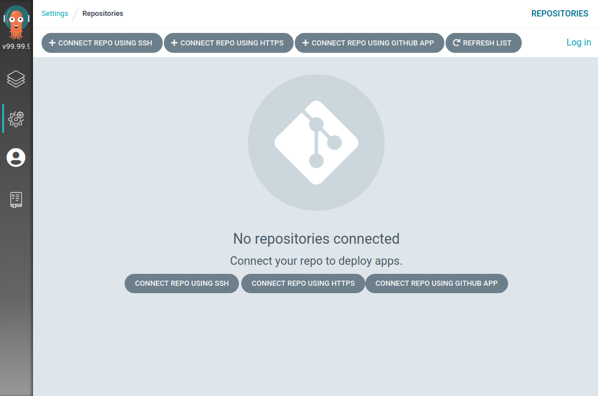
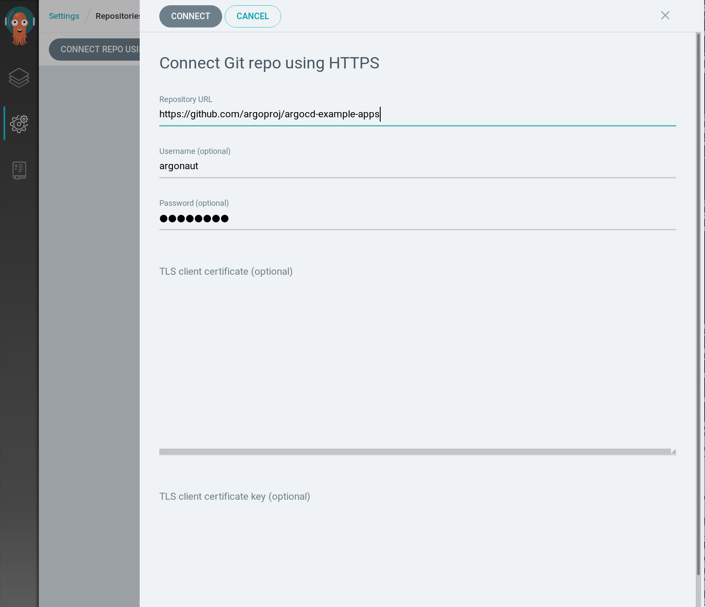
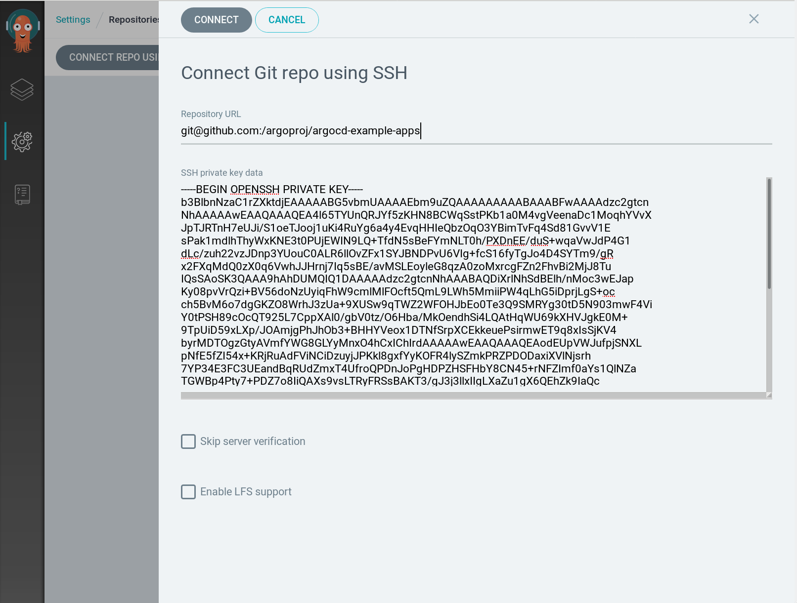

# Deployinh a Helm Chart

In this document, we will describe how to configure ArgoCD in order to deploy a Helm chart that is stored in a private git repository 

## Configuring Git credentials

Before configuring the application, we have to configure the credentials of our private git repository.

ArgoCD supports both Username/password and SSH git credentials.

### Configure username/password credentials

In order to configure the Username/password credentials of your private git repository, connect to the dashboard

Nvigate to `Settings/Repositories`



Click on `CONNECT REPO USING HTTPS`

And insert your credentials



### Configuring Ssh private key credential

We can configure a private git repository credentials using ssh with argocd CLI or ArgoCD dashboard.

#### Using the CLI

```
argocd repo add git@github.com:argoproj/argocd-example-apps.git --ssh-private-key-path ~/.ssh/id_rsa
```

#### Via the GUI

Navigate to Settings/Repositories


Then, click on `CONNECT REPO USING SSH`, and insert your ssh key.



After completing the authentication part, you should see an output like the following:


## Deploying the application

After configuring the credentials, we will create the application.

First of all, if you will use ArgoCD to manage multiple projects, it's recommended to organize your applications by `Projects`

We will create ouf first project called powercard

```
kubectl create -f manifests/03-appproject.yaml
```

Then, we will create an application

```
kubectl create -f manifests/04-application.yaml
```

Notice that you need to the namespace manifets in your chart.