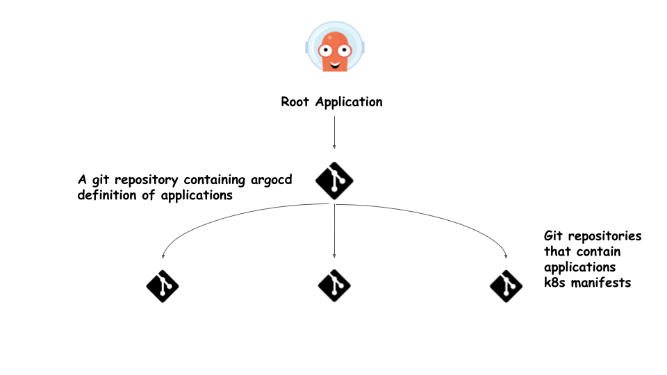

# Application of applications pattern

As we saw in the previous sections, in order to deploy a single application with ArgoCD, we have created a manifest file that describes the application repository and parameters.

In our case, we need to deploy a microservise architecture application, which is composed of multiple services, ArgoCD recommends using a different pattern instead of configuring an application file for each service in ArgoCD.

This pattern is called `app of apps`, and consists of storing application definitions in a git repository, and only configure a root application in argocd, which points to the git repository that contains the applications definition files.



An example of the root application

```
apiVersion: argoproj.io/v1alpha1
kind: Application
metadata:
  name: root-app
  namespace: argocd
  finalizers:
  - resources-finalizer.argocd.argoproj.io
spec:
  destination:
    namespace: default
    name: in-cluster
  project: default
  source:
    path: apps
    repoURL: https://github.com/hichamov/argocd.git
    targetRevision: HEAD
```

The content of the `apps` directory in the git repository contains the two following files:

`helloworld.yaml`

``` 
apiVersion: argoproj.io/v1alpha1
kind: Application
metadata:
  name: helm-helloworld
  namespace: argocd
  finalizers:
  - resources-finalizer.argocd.argoproj.io
spec:
  destination:
    namespace: helm-helloworld
    name: in-cluster
  project: default
  source:
    path: hello-world
    repoURL: https://github.com/hichamov/helm-hello-world.git
    targetRevision: main
```

And `helm.yaml`
```
apiVersion: argoproj.io/v1alpha1
kind: Application
metadata:
  name: python-hello-world
  namespace: argocd
  finalizers:
  - resources-finalizer.argocd.argoproj.io
spec:
  destination:
    namespace: hello
    name: in-cluster
  project: default
  source:
    path: manifests
    repoURL: https://github.com/hichamov/python-helloworld.git
    targetRevision: HEAD
```