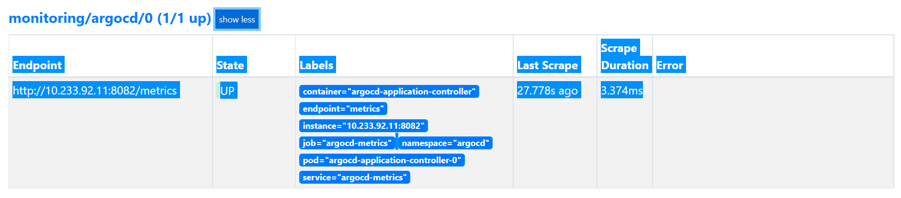

# Monitoring ArgoCD with Prometheus and Grafana

When installing ArgoCD, it installs a prometheus exporter that exposes ArgCD metrics automatically.

The service installed is named `argocd-metrics` and exposes a pod called `argocd-application-controller-0`.

So all we have to de is to create a servicemonitor to tell promtheus to scrap metrics exposed by this service.

## Configuring Prometheus

You can find a servicemonitor example [here](../manifets/05-servicemonitor.yaml).

Then, edit the prometheus configuration with the following command

```
kubectl edit prometheus k8s
```

And the line `argocd` to the configuration

```
  serviceMonitorSelector:
    matchExpressions:
    - key: k8s-app
      operator: In
      values:
      - node-exporter
      - kube-state-metrics
      - apiserver
      - kubelet
      - mycustomapp
      - kafka-exporter
      - kafka-jmx
      - zookeeper-jmx
      - kube-controller-manager
      - openebs
      - kafka-minion
      - crunchydata
     - argocd
```

Finally, delete the promtheus pod to reload the configuration.

After Prometheus configuration, go to prometheus UI, and access `Status/Targets` section, you should see ArgoCD targey in UP state




## Configuring Grafana

ArgoCD team offers a Ready-ti-use grafana dashboard.

We can use this dashboard in many ways:

* Importing the dashboard via grafana using the following [link](https://grafana.com/grafana/dashboards/14584).
* Add the dashboard in a k8s configmap, the [dashboard](../manifets/06-grafana-dashboard.json) is in a json format 