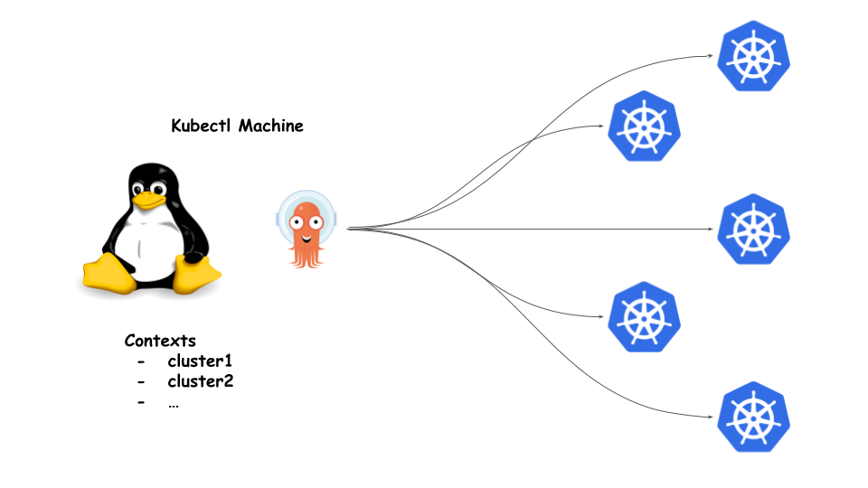
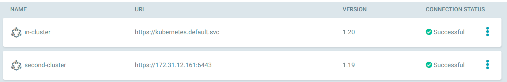
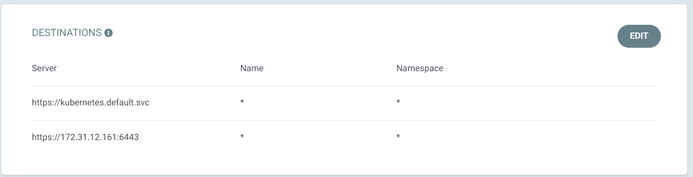

# Using a single ArgoCD to deploy to multiple clusters




In the real world environments, we usually have multiple k8s clusters, one per environment, or one per project, in this case, we can use a single ArgoCD deployment to manage the deployments for all these clusters instead of wasting resources for multiple ArgoCD deployments.

In order to add an existing k8s cluster to ArgoCD, we have to use the CLI, please reffer the following link [link](https://argo-cd.readthedocs.io/en/stable/cli_installation/) to install ArgoCD CLI on your machine.

ArgoCD CLI relies on the local `~/.kube/config` file to retrieve the credentials to access the new cluster, for example, in this case, we have two contexts, if ArgoCD is installed in the first cluster, to add the second cluster to argocd, we will use the context name `second` 

```
root@node1:~/clusters# kubectl config get-contexts
CURRENT   NAME     CLUSTER         AUTHINFO                  NAMESPACE
          first    cluster.local   kubernetes-admin          argocd
*         second   second          second-kubernetes-admin
```

Use the following command

```
argocd cluster add second --name second-cluster
```

NB: Don't give admin accounts to ArgoCD, it's recommended to create accounts with limited access.

After Adding the new cluster, in to ArgoCD dashboard, under `Settings/Clusters`, you will see that the second cluster was added successfully.



After adding the new cluster successfully, if you have created a project, you need to add the new cluster to the existing project.

To do this, Go to `Settings/Projects/your_project_name` under destination section, add the new cluster.



To install an appliction in the new cluster, please reffer to this [link](./Helm.md).